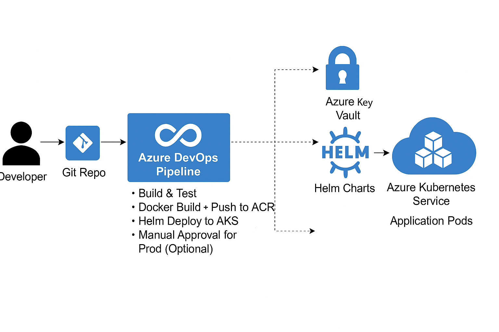

# CI/CD Pipeline with Azure DevOps for AKS using Helm & ACR

## 📌 Overview
This project demonstrates a complete CI/CD pipeline to deploy a containerized application to Azure Kubernetes Service (AKS) using Azure DevOps, Helm, and Azure Container Registry (ACR).

## 🏗️ Tech Stack
- Azure DevOps Pipelines
- Azure Kubernetes Service (AKS)
- Azure Container Registry (ACR)
- Azure Key Vault
- Helm
- Docker

## 🗺️ Architecture

## 🚀 Pipeline Stages
1. Build & Test (Docker image)
2. Push to ACR
3. Deploy to AKS using Helm
4. Secret injection from Azure Key Vault
5. Manual approval for production

## 📂 Project Structure
<Add explanation of key folders like charts/, .azure-pipelines/, etc.>

## ✅ How to Run
1. Clone repo and set up service connections in Azure DevOps
2. Configure variables in the pipeline YAML
3. Run pipeline from Azure DevOps UI or trigger on push

## 📹 Demo
<Insert link to demo video or embed gif>

## 📚 References
- [Azure DevOps YAML Pipelines](https://learn.microsoft.com/en-us/azure/devops/pipelines/?view=azure-devops)
- [Helm](https://helm.sh/)
